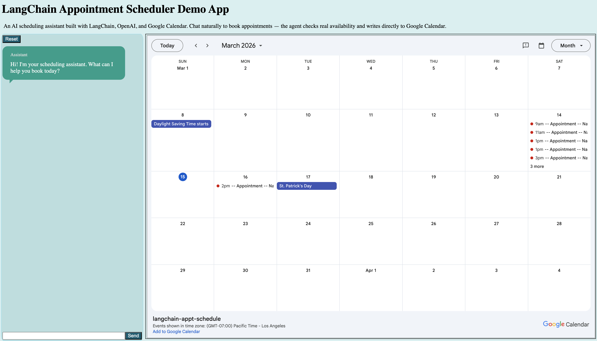

# LangChain Appointment Scheduler

An AI scheduling assistant built with LangChain, OpenAI, and Google Calendar.
Chat naturally to book appointments — the agent checks real availability and
writes directly to Google Calendar.

🔗 **[Live Demo](your-url-here)**



## What It Does

Chat with an AI agent to schedule appointments. The agent collects your
information, checks real calendar availability, and books confirmed appointments
directly to Google Calendar — all through natural conversation.

## Tech Stack

- **LangChain** — agent orchestration and tool calling
- **OpenAI** (gpt-4o-mini) — LLM backbone
- **Google Calendar API** — real availability checking and appointment creation
- **Express** — backend server and session management
- **TypeScript** — end to end
- **Vanilla HTML/CSS/JS** — frontend (no framework)

## Features

- Natural language scheduling via chat interface
- Real-time Google Calendar availability checking
- Writes confirmed appointments directly to Google Calendar
- Session management with reset capability
- Split-screen chat + live calendar view

## Project Structure
```
├── index.ts              # CLI entry + LLM core loop
├── src/
│   ├── server.ts         # Express server
│   ├── session.ts        # Session management
│   ├── app.ts            # Frontend JS
│   └── index.html        # Frontend markup
├── google/
│   ├── auth.ts           # OAuth + token management
│   └── calendar.ts       # Calendar API calls
└── tools/                # LangChain tool definitions
```